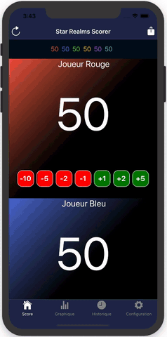
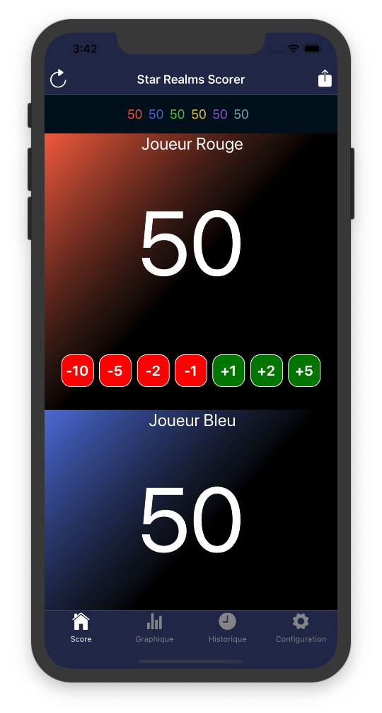

# React Native Project

Small clone of Star Realms Scorer with React Native.

## Preview

## Screen

## Installation

npm i

## Start

expo start

## TODO

- [x] React Native App
- [x] Add React Navigation
- [x] Add Redux Store
- [ ] Screen : Setting
- [ ] Add possibility to change Player Name
